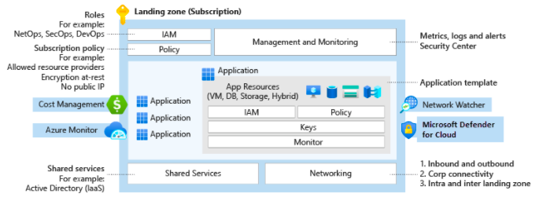
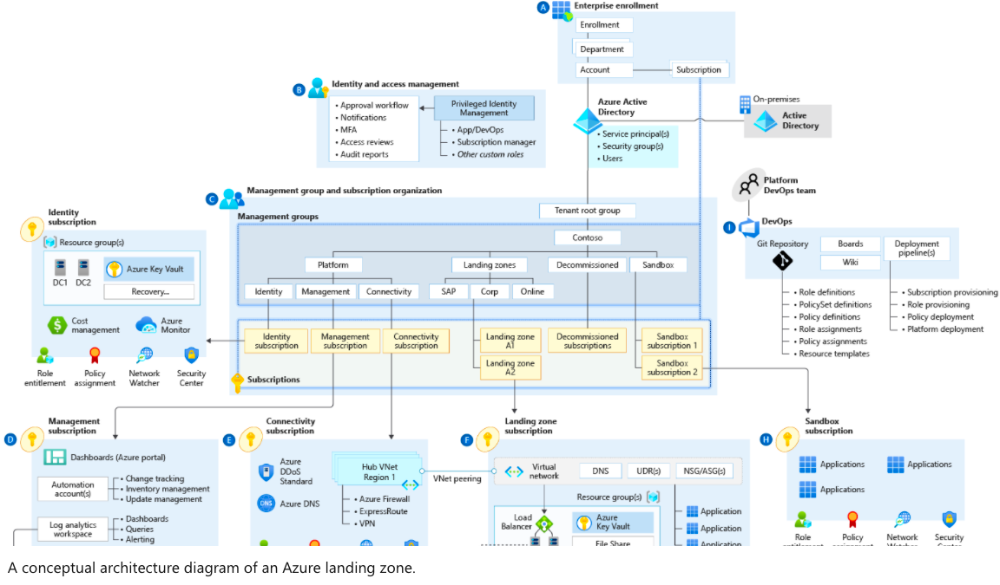
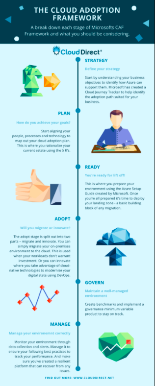

# What is an Azure Landing Zone ?

Azure landing zones are the output of a multisubscription Azure environment that accounts for scale, security governance, networking, and identity. Azure landing zones enable application migration, modernization, and innovation at enterprise-scale in Azure. These zones consider all platform resources that are required to support the customer's application portfolio and don't differentiate between infrastructure as a service or platform as a service.



Here's what Microsoft Official Article says about a landing Zone - [Watch it Here](https://www.microsoft.com/en-us/videoplayer/embed/RE4xdvm?postJsllMsg=true)

## Features of Azure Landing Zone

1. Scalable

All Azure landing zones support cloud adoption at scale by providing repeatable environments, with consistent configuration and controls, regardless of the workloads or Azure resources deployed to each landing zone instance.

2. Modular

All Azure landing zones provide a modular approach to building out your environment, based on a common set of design areas. Each design area can be easily extended to support the distinct needs of various technology platforms like Azure SQL Database, Azure Kubernetes Service, and Azure Virtual Desktop.

## Azure landing zone conceptual architecture

For many organizations, the Azure landing zone conceptual architecture below represents the destination in their cloud adoption journey. It's a mature, scaled-out target architecture intended to help organizations operate successful cloud environments that drive their business while maintaining best practices for security and governance.

This conceptual architecture represents scale and maturity decisions based on a wealth of lessons learned and feedback from customers who have adopted Azure as part of their digital estate.

While your specific implementation might vary, as a result of specific business decisions or existing investments in tools that need to persist in your cloud environment, this conceptual architecture will help set a direction for the overall approach your organization takes to designing and implementing a landing zone.



# What is Cloud Adoption Framework ?

The Cloud Adoption Framework (CAF Framework) is a collection of documentation, implementation guidance, best practices, and tools that are proven guidance from Microsoft designed to accelerate your cloud adoption journey. There are six stages to the CAF framework, and each stage has been crafted to help you accelerate your cloud adoption journey. Think of the CAF framework as your guide to making the most of your Azure investment.

It’s important to note that the CAF framework isn’t just for businesses that are new to the cloud, it can be used by businesses at any stage of their cloud journey. And we’re here to help you understand how you can start using it.

## What are the six stages of the Cloud Adoption Framework?

1. Strategy

Start by understanding your business objectives to identify how Azure can support them. Microsoft has created a Cloud Journey Tracker to help identify the adoption path suited for your business.

2. Plan

Start aligning your people, processes, and technology to map out your cloud adoption plan. This is where you rationalize your current estate using the 5 R’s of application modernisation.

3. Ready

This is where you prepare your environment using the Azure Setup Guide created by Microsoft. Once you’re all prepared it’s time to deploy your landing zone – a basic building block of any migration.

4. Adopt

The adopt stage is split out into two parts – migrate and innovate. You can simply migrate your on-premises environment to the cloud. This is used when your workloads don’t warrant investment. Or you can innovate where you take advantage of cloud-native technologies to modernise your digital state using DevOps.

5. Govern

Create benchmarks and implement a governance minimum variable product to stay on track. Working with an Azure Expert MSP can help you govern your environment, helping you maintain your progress.

6. Manage

Monitor your environment through data collection and alerts. Manage it to ensure your following best practices to track your performance. And make sure you’ve created a resilient platform that can recover from any issues.



References : [What is Cloud Adoption Framework](https://www.clouddirect.net/what-is-the-cloud-adoption-framework/)


# Going through the Bicep code

The Bicep project is configured to work on the following principle

- The **main.bicep** creates all the Resource Groups, DDOS Plan and call the **resourcezone.bicep** file. Later it creates the VNET Peering and VPN Gateway
- The **resourcezone.bicep** in returns calls the modules in **modules** directory and creates the resources.
- The **main.parameters.json** file is passed to the command which contains all the key value pair of names of the resources. You need to exchange **"<Your Value Here>"** with your values.

## Some code examples

The **main.bicep** file starts with a **targetScope** variable which defines the deployment scope of the code.

```
targetScope = 'subscription'
```

Then it defines the parameters and their type

```
param resourceArray array
param vpnGatewayConnectionArray array
param vnetPeeringArray array
param DDoSProtectionPlan object
```

The code is defined to run in loops for the values it gets from the parameter file. Here **resourceArray**, **rgName**, **rgLocation** and **tags** are the keys in **main.parameters.json** file.

```
resource rgs 'Microsoft.Resources/resourceGroups@2021-04-01' = [for (res, i) in resourceArray: {
  name: res.rgName
  location: res.rgLocation
  tags: res.tags
}]
```

Another example of creating a VNET peering. You can see few additional lines of code here. The **dependsOn** work similar way like **depends_on** in Terraform. The resource will get created only after the dependent resource is created.

```
module vnetpeeringM 'modules/vnetpeering.bicep' = [for (vnetpeer, i) in vnetPeeringArray: {
  name: '${vnetpeer.fromRgName}-VNETPEERING-Module-${i}'
  scope: resourceGroup(vnetpeer.fromRgName)
  dependsOn: [
    reszoneM
  ]
  params: {
    vnetpeeringdata: vnetpeer
  }
}]
```

You can also define variables in your bicep code. Here's an example from **applicationgateway.bicep** file

```
var appgw_id = resourceId('Microsoft.Network/applicationGateways', appGWData.name)
```

The parameter file is a simple json file which holds value of all the variables.

```
{
    ................... Truncated ...................
    "vNetArray": [
        {
            "vNetName": "<Your Value here>",
            "tags": {
                "Created By": "<Your Value here>",
                "Customer": "<Your Value here>",
                "Env": "<Your Value here>",
                "Region": "<Your Value here>",
                "App": "<Your Value here>",
                "Cost Center": "<Your Value here>",
                "Department": "<Your Value here>",
                "Owner": "<Your Value here>",
                "Policy": "<Your Value here>",
                "Product": "<Your Value here>",
                "SalesforceCSTID": "<Your Value here>",
                "SLASeverity": "<Your Value here>",
                "Stakeholders": "<Your Value here>",
                "Tier": "T<Your Value here>1"
            },
            "DDoSProtectionPlanName": "<Your Value here>",
            "DDoSProtectionRGName": "<Your Value here>",
            "vNetAddressSpace": "<Your Value here>",
            "logAnalytics": {
                "workspaceRGName": "<Your Value here>",
                "logStorageAccountName": "<Your Value here>",
                "logWorkSpaceName": "<Your Value here>"
            },
            "subnets": [
            {
                "vNetName": "<Your Value here>",
                "subnetName": "<Your Value here>",
                "SubnetAddressSpace": "<Your Value here>",
                "networkSecurityGroupName": "<Your Value here>",
                "routeTableName": "<Your Value here>"
            },
            {
                "vNetName": "<Your Value here>",
                "subnetName": "AzureBastionSubnet",
                "SubnetAddressSpace": "<Your Value here>",
                "networkSecurityGroupName": "",
                "routeTableName": ""
            },
            {
                "vNetName": "<Your Value here>",
                "subnetName": "AzureFirewallSubnet",
                "SubnetAddressSpace": "<Your Value here>",
                "networkSecurityGroupName": "",
                "routeTableName": "<Your Value here>"
            },
            {
                "vNetName": "<Your Value here>",
                "subnetName": "GatewaySubnet",
                "SubnetAddressSpace": "<Your Value here>",
                "networkSecurityGroupName": "",
                "routeTableName": ""
            }
            ]
        }
        ]
    .................. Truncated ................
```

## Resources that are created

The list of resources created by this Bicep Project are as follows : -

- General
    - Azure Policy to Allow only specific regions

- Landing Zone
    - Resource Group
    - Virtual Network, Subnets and Peering to Non-Prod Zone and Prod Zone
    - Azure Firewall with sample rules
    - Azure Bastian Host
    - Network Security Group with sample rules
    - Azure Storage Account
    - VPN Connection to Remote Site Zone

- Non Prod Zone
    - Resource Group
    - Virtual Network, Subnets and Peering to Landing Zone
    - Network Security Group with Sample rules
    - Azure Virtual Machine
    - Azure SQL Database
    - Azure Storage Account

- Prod Zone
    - Resource Group
    - Virtual Network, Subnets and Peering to Landing Zone
    - Network Security Group with Sample rules
    - Azure Virtual Machine
    - Azure SQL Database
    - Sample App Service
    - Log Analytics Workspace
    - Azure Storage Account

- Remote Site Zone (Read as On-Premise Network)
    - Resource Group
    - Virtual Network. Subnets
    - VPN Connection to Landing Zone
## Diagram

Here's a rough diagram of the resources it creates


## Run the code

### Authenticate Azure CLI

Hit the command **az login** from Comamnd Prompt or Terminal depending upon your OS. More details can be found [here](https://docs.microsoft.com/en-us/cli/azure/get-started-with-azure-cli)

### Trigger Manually

Fire the below command to create the resources using Bicep script

> az deployment sub create --location WestUS --name ExampleDeployment --template-file main.bicep --parameters main.parameters.json