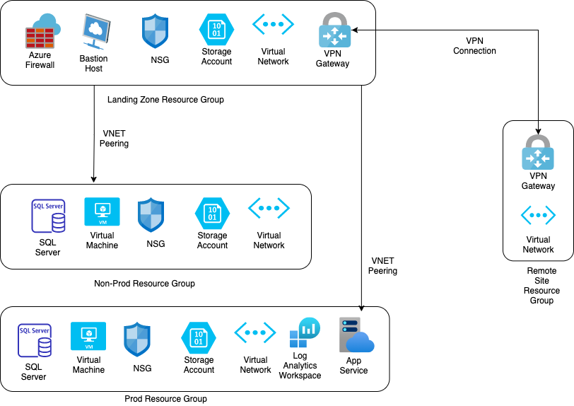

# Deployment Steps

## Resources details

The list of resources created by this Bicep Project are as follows : -

- General
    - Azure Policy to Allow only specific regions

- Landing Zone
    - Resource Group
    - Virtual Network, Subnets and Peering to Non-Prod Zone and Prod Zone
    - Azure Firewall with sample rules
    - Azure Bastian Host
    - Network Security Group with sample rules
    - Azure Storage Account

- Non Prod Zone
    - Resource Group
    - Virtual Network, Subnets and Peering to Landing Zone
    - Network Security Group with Sample rules
    - Azure Virtual Machine
    - Azure SQL Database
    - Azure Storage Account

- Prod Zone
    - Resource Group
    - Virtual Network, Subnets and Peering to Landing Zone
    - Network Security Group with Sample rules
    - Azure Virtual Machine
    - Azure SQL Database
    - Sample App Service
    - Log Analytics Workspace
    - Azure Storage Account

## Diagram

Here's a rough diagram of the resources it creates

## Operations details

The Bicep project is configured to work on the following principle

- The **main.bicep** creates the general Azure policy, All Resource groups and call the **resourcezone.bicep**.
- The **resourcezone.bicep** in returns calls the modules in **modules** directory and creates the resources.
- The **main.parameters.json** file is passed to the command which contains all the key value pair of names of the resources.

### Trigger Manually

Fire the below command to create the resources using Bicep script

> az deployment sub create --location WestUS --name ExampleDeployment --template-file main.bicep --parameters main.parameters.json